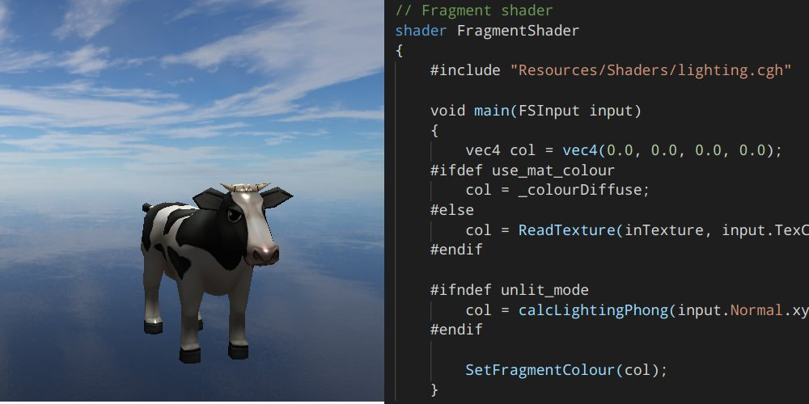

# Ming3D
Game engine, for Windows and Linux.

Supports rendering with OpenGL and DirectX11.

# How to clone and build

__Requirements__
- CMake: https://cmake.org/download/
- Conan package manager: https://conan.io/downloads.html
- A C++ compiler (tested with g++ and Visual Studio 2017 and 2019)

__WINDOWS__
- Clone (recursively, since it contains modules): git clone --recursive https://github.com/mlavik1/Ming3D
- Open CMake, and set source code directory ("Where is the source code: " in CMake GUI) to the repository root directory
- Configure and Generate
- Optionally: For the sample projects, modify the "SampleProject" variable to select the type of sample you want to use.

__LINUX__
- Clone the repository (recursively!): git clone --recursive https://github.com/mlavik1/Ming3D
- Terminal: sudo -v  (Only first time. This is needed because of the SDL2 conan package)
- Terminal: cmake -G "Unix Makefiles" (alternatively, you can configure from VSCode, QtCreator or another IDE)
- Build a project (such as Runtime): make Runtime
- Run the executables (in the "build" folder). Make sure "Engine/Resources" is placed under the same folder as the executable (just create an empty "Engine" folder and copy "Resources" over to it).

(NOTE: You need at least OpenGL 4.0)

# Renderer

Has support for:
- Rendering with OpenGL or DirectX11
- Cross platform shaders, that are automatically converted to GLSL or HLSL (still missing some features)
- Abstractions for: Textures, Vertex Buffers, Shaders, Uniforms / Constant Buffers
