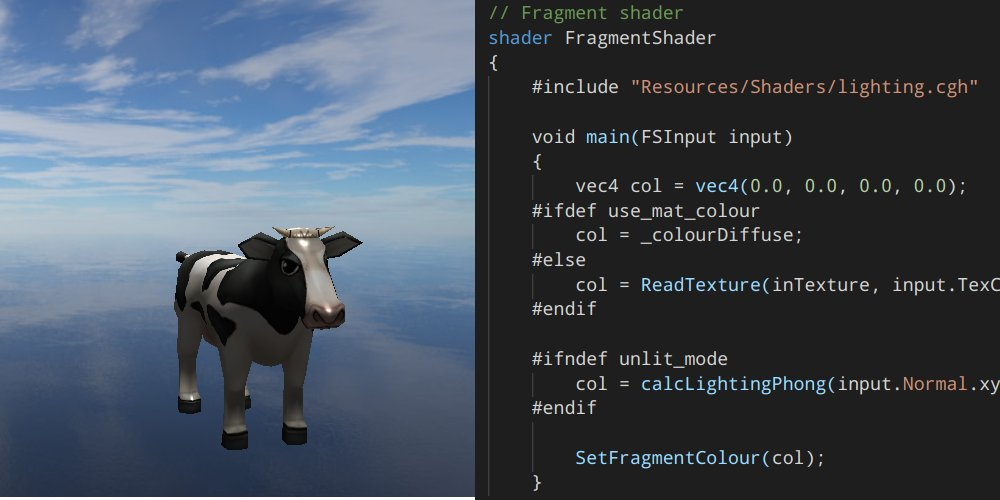

> [!WARNING]
> Old project. Quite messy and lacks proper mamemory managent. May'be I'll revisit it someday!

# Ming3D
Game engine, for Windows and Linux.

Supports rendering with OpenGL and DirectX11.



# Features

- Rendering with OpenGL or DirectX11
- Cross platform shaders, that are parsed and automatically converted to GLSL or HLSL.
- WIP: Physics using PhysX
- WIP: GUI system
- WIP: Editor (rendered using Ming3D's GUI system)

# How to clone and build

__Requirements__
- CMake (>= 3.3): https://cmake.org/download/
- Conan 2 package manager: https://conan.io/downloads.html
- A C++ 17 compiler (tested with g++ and Visual Studio 2017 and 2019)

__LINUX__
1. Clone the repository (recursively!): `git clone --recursive https://github.com/mlavik1/Ming3D`
2. Install system dependencies (X11, OpenGL):
   ```bash
   sudo apt-get install -y libgl-dev libx11-dev libxext-dev libxrandr-dev libxinerama-dev libxcursor-dev libxi-dev
   ```
3. Install Conan dependencies and configure:
   ```bash
   conan install . --output-folder=build --build=missing -s compiler.cppstd=17 -s build_type=Debug
   cmake -B build
   ```
4. Build: `cmake --build build`
5. Run the executables (in the `build` folder). Make sure `Engine/Resources` is placed under the same folder as the executable.

__WINDOWS__
1. Clone (recursively): `git clone --recursive https://github.com/mlavik1/Ming3D`
2. Install Conan dependencies and configure:
   ```bash
   conan install . --output-folder=build --build=missing -s compiler.cppstd=17 -s build_type=Debug
   cmake -B build
   ```
3. Open the generated solution in Visual Studio, or build from command line: `cmake --build build`
4. Optionally: modify the `SampleProject` variable to select the type of sample you want to use.

(NOTE: You need at least OpenGL 4.0)
